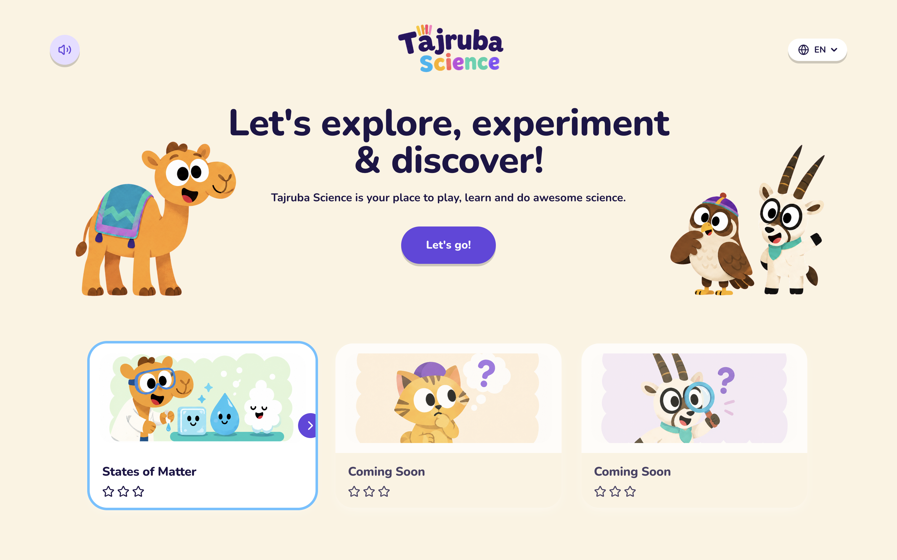

# Tajruba Science — interactive Grade 4 platform

A web-based learning platform that teaches Grade 4 students the states of matter through play, built as a take-home submission for the Frontend Developer (Interactive UI & Gamification) role.

## Live demo

**[https://tajruba-science.vercel.app/](https://tajruba-science.vercel.app/)**



## The brief, restated

Task asked for a gamified Grade 4 science learning interface that engages kids through interaction design, fits a UAE cultural identity, and is built with React/Next.js. The reader should be able to open the link, click around for five minutes, and come away convinced that a child in this age group would actually want to use it — and would learn something while they did.

## How I approached this

Before writing any code, I spent time thinking about what would actually serve a Grade 4 student learning a topic 'states of matter'. Three principles came out of that, and they shaped the whole build:

**Make it for the student.** When a child in Abu Dhabi opens this, they should feel like it was built with them in mind. The UAE-inspired characters — camel, falcon, oryx — are there to ground the experience in something familiar, so the science feels closer.

**Go deep on one thing.** I chose one grade, one subject, one topic, and built one game in depth. If a student finishes Game 1, the goal is that they leave with real intuition about how matter behaves.

**Let kids build.** The core interaction in Game 1 is making something — dragging particles into a container, watching them form a state, combining that with everyday objects to see what happens. The quiz comes after, to reinforce what they discovered through play.

## The four games

The other three games were designed with the same intent — each building a different piece of intuition about matter through doing, not telling.

**Game 2 — Mosque Systems.** Students build a mosque using each state of matter, then run wind and earthquake tests to see which holds. The intuition: solids hold their shape under stress, liquids flow away, gases disperse — and that's why we build with the materials we do.

**Game 3 — Water the Plant.** Students heat a water droplet, watch it rise as vapor, cool it near the top so it condenses into a cloud, and rain it back onto a thirsty plant. The intuition: water moves through states as temperature changes, and that cycle is what brings rain.

**Game 4 — Wadi Crossing.** Students switch between states to cross a desert valley — flowing as a liquid through narrow rock cracks, rising as gas through hot vents, freezing solid to walk over a windy gap. The intuition: each state of matter has its own properties, and matter changes state to fit the situation.

## What's built and what's mocked

Being explicit about scope so the panel knows what to look at:

**Fully built**

- Landing page, topic page, and per-game page with shared layout
- **Game 1: Make Your Own Matter** — a Phaser scene with drag-and-drop particles, a vertical slider for combining states with everyday objects (earth, tree, industry), state classification by particle count, a discovery system that lights up badges as students find each state, and an in-canvas mute toggle
- **Quiz panel for all four games** — five questions each, in English and Arabic, with first-attempt scoring, hints, and a per-game star reward (0–3)
- **Reward system** — stars per game persist in `localStorage`, aggregate to a topic-level counter, and survive page reloads
- **Reset progress** — a small button on the topic page to clear all earned stars
- **Bilingual support** — full English and Arabic, with RTL flipping for icons, layout, and content
- **Responsive layout** — desktop and tablet (1024px) are the design targets; mobile renders gracefully but is not the primary form factor
- **Test suite** — 61 tests covering data integrity, scoring logic, and the quiz state machine

**Mocked with previews**

Games 2, 3, and 4 each show a high-fidelity reference image of their intended gameplay, behind a "Coming Soon" overlay, with a working quiz. The mechanics are described above. This was a deliberate trade-off: one game built end-to-end to showcase the potential of building all the games using the same principles.

## Design system & visual language

The visual system draws from Duolingo, Lingokids, and UI Kids — the same family of friendly, high-saturation, character-led learning interfaces that Grade 4 students already recognise as "made for them." Every screen has at least one character on it; soft pastels and rounded corners keep the surface inviting; key actions (a starting button, a correct answer) get a touch of motion or confetti so the moment feels rewarded.

The cultural layer comes through the cast — a camel, a falcon, an oryx, a desert cat — rather than through literal landmarks. The goal was to make the platform feel native to the region without making it a tour of it.

## Reward & gamification mechanics

Three threads, drawn from how Lingokids and Duolingo keep young users coming back:

- **Stars per game (0–3).** Awarded based on how many quiz questions the student got right on the first try. A topic-level counter aggregates them so progress is always visible.
- **Illustrated companions.** Each game has its own character — camel scientist, water droplet, desert explorer, owl architect — to give the student something to play alongside, not just a UI to manipulate.
- **Juicy micro-feedback.** Confetti on correct answers, a shake on wrong ones, a smooth page-transition progress bar, sound on/off control, and a celebratory "Quiz Complete" screen at the end of each game.

## Bilingual support

The whole platform ships in English and Arabic. Every string, every quiz question, every hint has both translations. The page direction switches to RTL when Arabic is selected; arrows, chevrons, and progress dots flip with it. The language preference persists in `localStorage` and survives reloads.

## Tech stack

- **Next.js 15** (App Router, React 19)
- **TypeScript** with strict mode
- **Phaser 3** for the playable game (dynamic-imported on the client)
- **Tailwind CSS** for styling
- **Vitest + React Testing Library** for the test suite
- **canvas-confetti** for celebration moments
- **Radix UI** primitives only where actually used (dropdown, switch)

## Architecture overview

Three routes, all in the App Router:

- `/` — landing
- `/topic/[topicId]` — topic overview, game cards, star aggregate
- `/game/[gameId]` — game canvas + parallel quiz panel + sub-topic cards

State is kept simple: language and progress live in `localStorage`, with a custom event so all open tabs and components stay in sync. Phaser is dynamic-imported only on the game route so it never runs on the server.

## Running locally

```bash
# Node 20+ recommended
npm install
npm run dev          # http://localhost:3000
npm run test:run     # run the full test suite
npm run build        # production build
```

## Project structure

```
app/
  layout.tsx                  # root layout, providers
  page.tsx                    # landing
  topic/[topicId]/page.tsx    # topic overview
  game/[gameId]/page.tsx      # game + quiz panel
src/
  components/                 # CharacterSlot, QuizPanel, StarRow, etc.
  data/                       # topics, quizzes (EN + AR)
  games/make-your-own-matter/ # Phaser scene + config + assets
  hooks/                      # useProgress, useSound
  i18n/                       # LanguageProvider, strings
  assets/characters/          # illustrated cast (PNG)
tests/                        # data, logic, and component tests
```

## Tests

61 tests across four files, run with `npm run test:run`:

- **Data integrity** — every game has the right number of quiz questions, EN and AR `correctIndex` values match, every character ID resolves to an asset, every i18n key exists in both languages
- **Logic** — the `starsForScore` thresholds and the `useProgress` hook (set, read, never reduce earned stars, aggregate, reset)
- **Component** — the `QuizPanel` state machine: wrong answers don't advance, correct answers do, hint toggle persists, completion screen fires, scoring matches first-attempt logic

## Accessibility & responsive

- **Keyboard.** All interactive elements are real buttons or links; tab order follows visual order; focus rings are visible.
- **Screen readers.** Images have alt text; interactive controls have `aria-label`s; the language and direction attributes on `<html>` update when Arabic is selected.
- **Responsive.** Designed for desktop and tablet (≥1024px). Smaller viewports render the layout cleanly but are not the primary target — a deeper mobile pass is on the "more time" list.
- **Reduced motion.** Confetti respects `prefers-reduced-motion`.

## AI-augmented development

The brief allows AI tools, so this is being explicit about how they were used. I built this with Claude Code as a coding partner: scaffolding components, writing test cases, and pairing on the Phaser scene logic. The character art was generated with image models. Every architectural choice — the scope cut to one game, the layout system, the data model, the quiz state machine, the scope of the test suite — was made and validated by me. The AI accelerated execution; the design decisions are mine.

## Time spent

Three days, solo.

## What I'd do with more time

- Build Games 2, 3, and 4 for real — the designs are ready
- A character expression system (idle, cheer, think, celebrate) using Rive or Lottie, so the cast reacts to events instead of holding a single pose
- Voice narration of questions and hints for students still building reading fluency
- Original sound design (today the project uses synthesised tones)
- A WebGL/Three.js upgrade for the particle physics in Game 1
- An end-of-topic celebration screen that ties all four games together
- Deeper mobile pass — the desktop/tablet layout is solid, but portrait phones deserve their own tuning
- Wider accessibility audit (color contrast, screen-reader walkthrough, switch-control support)
